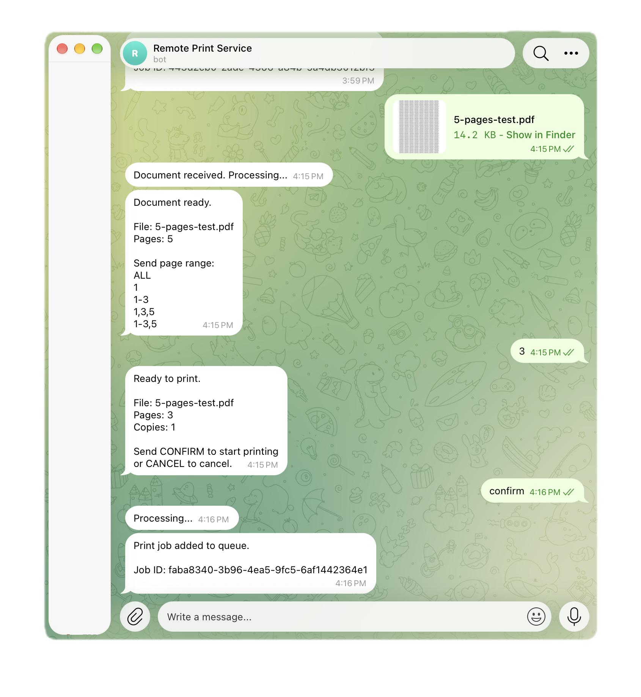

# Remote Print Service

Экспериментальный сервис для удалённой печати документов на обычном принтере, который
Изначально не поддерживает дистанционную сетевую печать.

Идея проекта – дать такому принтеру возможность принимать задания на печать удалённо:
Документ отправляется через Telegram с телефона или компьютеры, а Remote Print Service
Передает его на Windows-компьютер, которому к физически подключён принтер.

Проект является экспериментальным и не претендует на полноценную замену
специализированных решений для сетевой печати.



## Как это работает

iPhone / Mac
↓
Telegram Bot
↓
Remote Print Service
↓
Windows Print System
↓
USB-принтер

Remote Print Service запускается на Windows-компьютере, к которому физически подключён
принтер.

Telegram-бот принимает документ, после чего сервиса сдает задание на печать добавляет его 
в очередь и передает систему печати Windows.

## Возможности

- удалённая печать через Telegram
- поддержка PDF
- последовательная очередь печатью
- выбор страниц для печати
- ограничения доступа по Telegram Chat ID
- уникальный Job ID для каждого задания
- отслеживание статуса задания
- локальная обработка документов
- работа без проброса портов и публичного сервера
- возможность использовать обычный USB-принтер для удалённой печати

## Стек

- Java 26
- Spring Boot 4.0.8
- Maven
- Telegram Bot API
- Windows Print System

## Оборудование

Проект разрабатывался и тестировался со следующей конфигурацией:

- Windows PC
- Canon LBp 2900
- USB-подключение

Canon LBP 2900 не является обязательным. Работа с другими моделями принтеров может
потребовать дополнительное настройки и тестирования.

## Запуск

Клонируйте репозиторий:

```text
git clone <ССЫЛКА-НА-РЕПОЗИТОРИЙ>
```

Перейдите в дерикторию проекта:

```text
cd remote-print-service
```

Настройте необходимые переменные окружение и запустите приложение:

```text
mvnw.cmd spring-boot:run
```

Перед запуском Remote Print Service принтер должен быть установлен в Windows, подключён к
компьютеру и доступен в системе.

## Использование

1. Запусти Remote Print Service на Windows-компьютере.
2. Убедитесь, что принтер подключён и включён.
3. Отправьте PDF-документ Telegram-боту.
4. Выберите необходимые параметры печати.
5. Документ будет добавлен в очередь и отправлен на принтер.

## Cтатус проекта

Проект находится на экспериментальной стадии.

Основная идея уже реализована: PDF-документ можно отправить удалённо через Telegram и
распечатать на обычном USB-принтера, которые самостоятельно не поддерживает
дистанционную печать.

На текущему даве возможно ограничения, ошибки и проблемы совместимости с различными
моделями принтеров.
